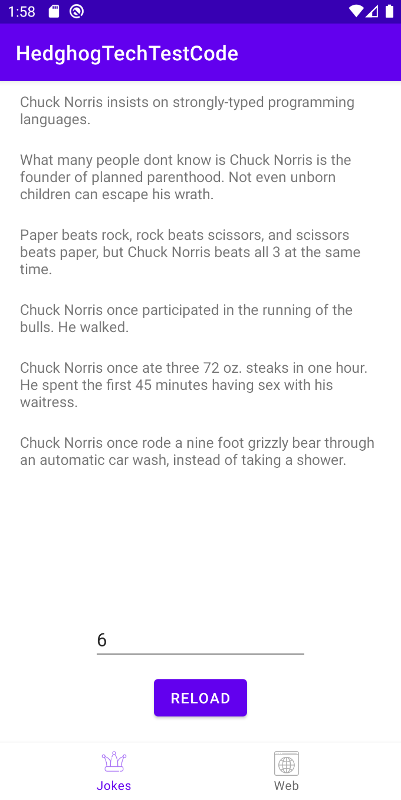
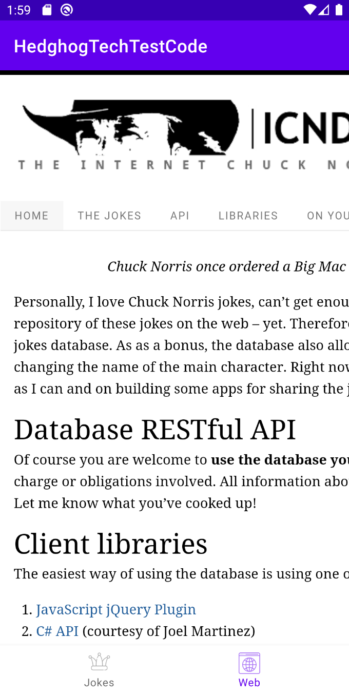

# Chuck Norris Jokes App

## About

This is a code test for Android Junior Developer position in Hedgehog Tech. 
The application has 2 screens, the first one is screen with Chuck Norris' jokes (screenshot 1), 
and the other one is screen with API documentation (screenshot 2). 

  
  

## API
I used a free [API](http://www.icndb.com/) of Chuck Norris Jokes. 
It's REST API and can be used without any API keys. 

## Architecture
In this app, I was following Clean Architecture principles.

## Libraries / Frameworks
* [Architecture](https://developer.android.com/topic/libraries/architecture) - a collection of libraries that help you
  design robust, testable, and maintainable apps.
    * [ViewModel](https://developer.android.com/topic/libraries/architecture/viewmodel) - this class allows data to
      survive configuration changes such as screen rotations
    * [LiveData](https://developer.android.com/topic/libraries/architecture/livedata) - this is an observable data
      holder class.
* [Navigation](https://developer.android.com/guide/navigation/navigation-getting-started) - a library that helps you implement navigation
* [Kotlin Coroutines](https://kotlinlang.org/docs/reference/coroutines-overview.html) - asynchronous or non-blocking
  programming
* [Retrofit](https://square.github.io/retrofit/) - a type-safe HTTP client
* [Dagger Hilt](https://dagger.dev/hilt/) - a DI framework 

